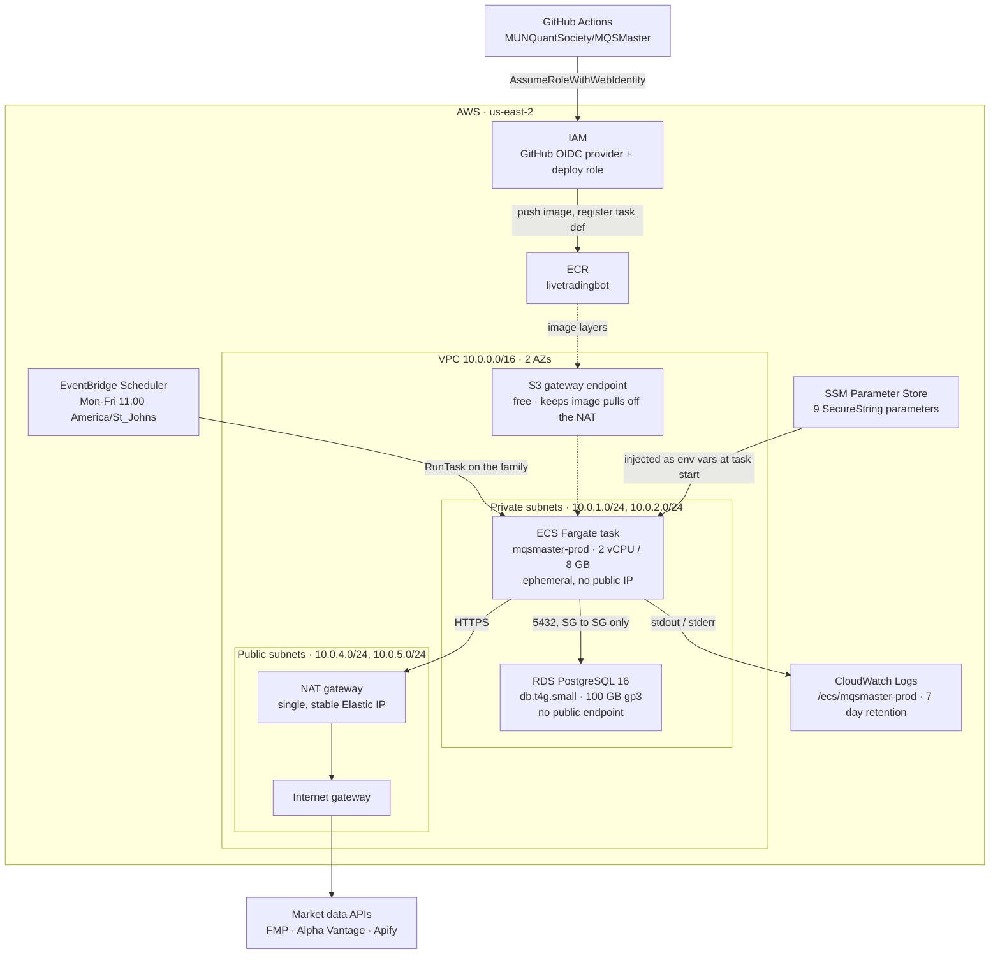
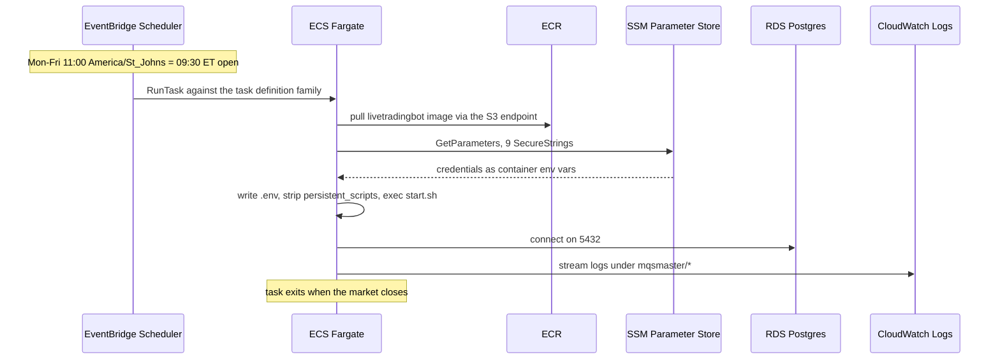

# Architecture diagram — Livetrading (deployed)

Reflects what is actually running in `us-east-2` as of 2026-08-09: 48 resources,
applied from `terraform/environments/Livetrading`.

Structural only — no account ID, resource IDs, endpoints or IP addresses. This
repository is public, and those values date the moment anything is replaced.
Read live values from the stack instead:

```bash
terraform output
```

## System



**There is no inbound path.** No load balancer, no public IP on the task ENI, no
public RDS endpoint. The task security group has zero ingress rules and allows
all egress; the database security group accepts `5432` only from the task
security group.

## A scheduled run



The scheduler targets the task definition **family**, not a pinned revision, so
a CI-registered revision is picked up by the next run with no Terraform apply
and no `UpdateService` call.

## What is deployed

| Service | Resources | Notes |
|---|---|---|
| VPC / EC2 networking | ~19 | VPC, 2 private + 2 public subnets, IGW, 1 NAT + EIP, route tables |
| Security groups + endpoint | 2 | Egress-only task SG, free S3 gateway endpoint |
| RDS PostgreSQL 16 | 3 | Instance, subnet group, DB SG. Deletion protection on |
| SSM Parameter Store | 9 | 6 × `/db/*`, 3 × `/api/*`, all SecureString, all write-only |
| IAM workload | 4 | Task execution role + policies, task role |
| IAM CI/CD | 3 | GitHub OIDC provider, deploy role, deploy policy |
| ECS cluster | 2 | Cluster + Fargate capacity providers |
| ECS market task | 1 | Task definition only — no service |
| EventBridge Scheduler | 3 | Schedule + RunTask role + policy |
| CloudWatch Logs | 1 | One group, 7 day retention |
| ECR lifecycle policy | 1 | Repo is adopted, not created |
| **Total** | **48** | |

## Deliberately absent

| Not deployed | Why |
|---|---|
| Always-on ECS Service | Removed. One workload, on a schedule — the cluster is idle between sessions |
| Load balancer | Nothing listens; there is no inbound path |
| Second NAT gateway | `single_nat_gateway = true`. One AZ failure point for egress, ~$65/mo saved |
| DynamoDB lock table | State locking is S3-native `use_lockfile`; `dynamodb_table` is deprecated in AWS provider 6.x |
| Backtest_Visualizer stack | Separate state key, never applied. Deployable later with no rework |
| CloudWatch alarms / SNS | Listed in the README as future work |

## State

Terraform state is in S3, not HCP — bucket `mqs-terraform-state` in `us-east-2`,
key `mqsmaster/Livetrading/terraform.tfstate`, locked with `use_lockfile`.
Versioning, SSE-S3 encryption, full public-access block and a TLS-only bucket
policy are on. See [operations.md](operations.md#state-backend).

## Cost

~$87–102/mo. RDS is the largest line, the NAT gateway second, Fargate compute
smallest because it bills only for the hours a session actually runs. Full
breakdown in [cost-model.md](cost-model.md).
